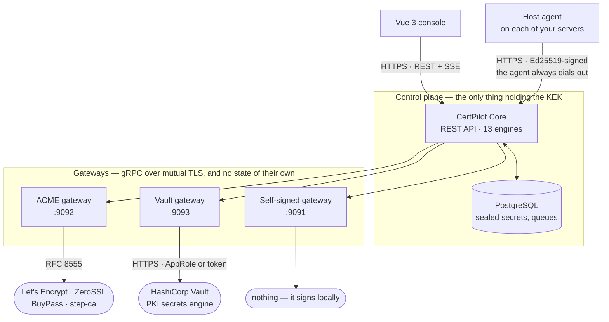
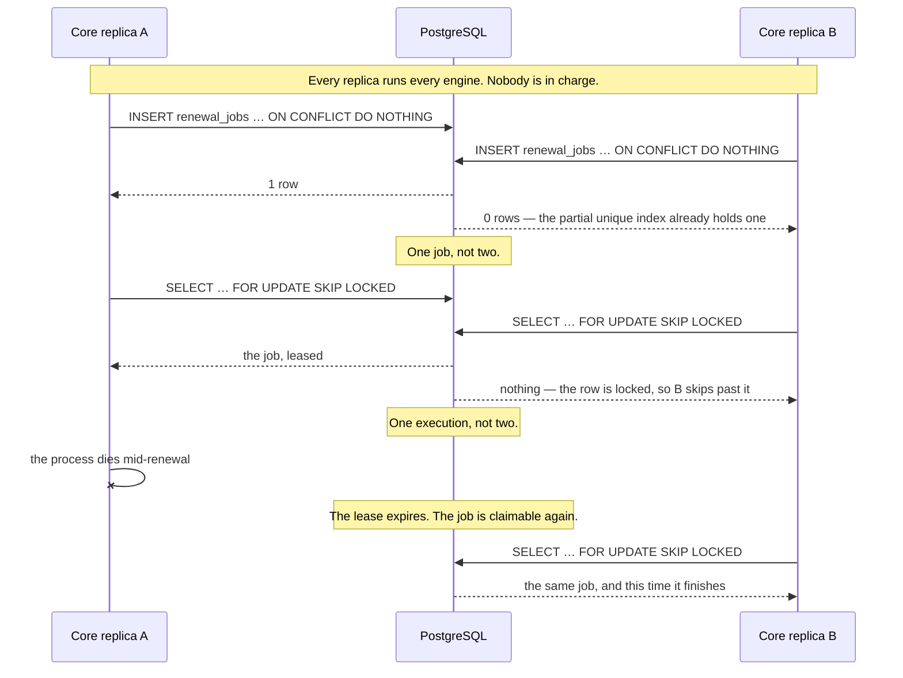
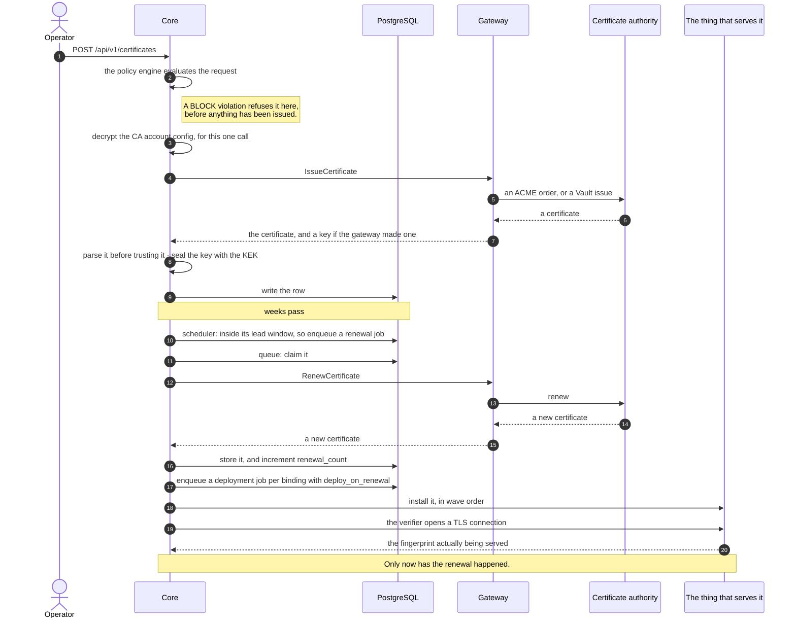
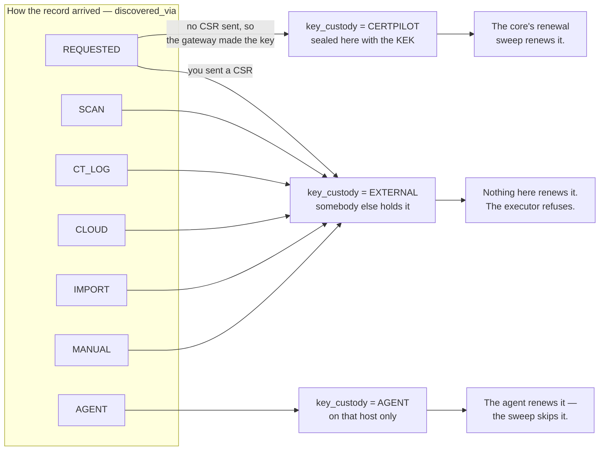

# Architecture

CertPilot is three kinds of process and one database.



The boxes are the easy part. What the arrows say is where the design is.

**The core-to-gateway links are mutually authenticated because of what they
carry** — CSRs, private keys and CA credentials, on every issuance. An
unauthenticated gateway is a machine that will sign anything for anyone.

**The agent arrow points the wrong way on purpose.** The core never dials a
host. A machine behind two firewalls can still hold a certificate, because it
is the one opening the connection.

**Nothing crosses into PostgreSQL except the core.** A gateway that could read
the database would be a CA integration with access to every sealed secret in
the system, and the first defect in a vendor SDK would be a breach rather than
a restart.

Everything below follows from three decisions.

## Decision 1 — a gateway is a process, not a package

The core knows nothing about ACME, Vault, or any specific CA. It knows one gRPC
contract, [`proto/provider/v1/provider.proto`](../proto/provider/v1/provider.proto),
and it dials processes that implement it.

This costs a network hop on every issuance. It buys four things:

**A CA integration cannot take down the control plane.** An ACME library with a
goroutine leak, a Vault client that blocks on a wedged connection, a
vendor SDK that calls `os.Exit` on a parse error — all of it is in another
process with its own lifecycle.

**Gateways upgrade independently.** A CA changes its API; you restart one
process. Nothing about certificates, renewals, deployments or the database is
involved.

**A gateway can be written in any language.** The contract is protobuf over
gRPC with mutual TLS. Nothing in it is Go-specific.

**You run only what you use.** An organisation with one Vault mount runs one
gateway and never has ACME code in memory.

The cost is real and worth naming: a gateway is a second thing to deploy,
monitor and give a certificate to. `make dev-certs` and the compose files
exist because that cost is otherwise paid by every person who tries the
project for ten minutes.

### What crosses the wire

Every request carries the CA account configuration it needs, as JSON, in
`provider_config`. The core stores that configuration **encrypted** and
decrypts it only to populate a single call. A gateway holds no CertPilot state
and never reads the database.

A gateway *may* keep its own local state where the protocol demands it — the
ACME gateway persists account keys in `--state-dir`, because an ACME account
must be stable across restarts. The Vault gateway keeps only the Vault tokens
it is currently renewing, in memory.

This is why the channel is mutually authenticated by default: it carries CSRs,
private keys, and CA credentials. See [security.md](security.md).

## Decision 2 — the store is an interface with two implementations

[`core/store/store.go`](../core/store/store.go) declares 147 methods.
`PostgresStore` talks to PostgreSQL over pgx. `MemoryStore` keeps maps.

The memory store is not a mock. It is a supported way to run the product — the
core starts with no database at all, seeds sample data, and works. That is what
makes a five-minute evaluation possible without provisioning anything.

It is also the source of an entire class of defect, and the reason
[`core/store/conformance_test.go`](../core/store/conformance_test.go) exists.
Four classes, all found in production-shaped runs before the suite was written:

| | What it looks like |
|:---|:---|
| **A** | A Go constant a `CHECK` constraint refuses |
| **B** | A model field one writer persists and the other drops |
| **C** | An empty Go string in a column whose `CHECK` passes on `NULL` |
| **D** | A bound parameter PostgreSQL types differently from the driver |

The suite runs the same assertions against both implementations, plus two
PostgreSQL-only tests for classes it alone can express. `make test-store`
runs it. See [database.md](database.md).

## Decision 3 — background work is a durable queue, not a goroutine

Renewal and deployment both go through tables, not channels:

```
renewal_jobs      status PENDING → RUNNING → SUCCEEDED | FAILED
deployment_jobs   status PENDING → RUNNING → SUCCEEDED | FAILED
```

A scheduler finds what is due and enqueues; a queue claims and runs. The claim
is `SELECT … FOR UPDATE SKIP LOCKED`, and the enqueue collides on a partial
unique index with `ON CONFLICT DO NOTHING`.

**There is no leader election, and that is the point.** Every replica runs
every engine. Two cores that both notice a certificate is due produce one job,
because the second `INSERT` hits the index. Two cores that both try to run it
produce one execution, because the second `SELECT` skips the locked row. A
core that dies mid-job holds a lease that expires, and another picks the job up.

The alternative — a leader — has a failover window during which nothing renews.
For a system whose entire purpose is that certificates do not expire, a window
in which nothing renews is the wrong failure mode.

Two replicas racing on the same certificate, and what the database does about
it:



## The processes

### Core

One binary, [`core/cmd`](../core/cmd). It serves the REST API and runs every
background engine in-process.

| Engine | Package | Default cadence | What it does |
|:---|:---|:---|:---|
| Renewal scheduler | `engine/renewal` | 60 min | Finds certificates inside their lead window, enqueues jobs |
| Renewal queue | `engine/renewal` | 5 s claim, 90 s lease | Claims and executes renewal jobs |
| ARI poller | `engine/renewal` | 6 h | Asks CAs for RFC 9773 renewal windows |
| Verifier | `engine/renewal` | — | Opens a TLS connection and checks the new certificate is actually being served |
| CA monitor | `engine/pki` | 6 h | Re-parses every CA, checks CRL and OCSP, crosses expiry thresholds |
| CA importer | `engine/pki` | 12 h | Asks gateways for their issuers and records them |
| Deployment queue | `engine/deploy` | 5 s claim, 60 s lease | Installs certificates where they are served |
| Discovery scheduler | `engine/discovery` | 1 min | Runs due network scans |
| CT monitor | `engine/ctlog` | 1 min | Watches Certificate Transparency logs for your domains |
| Cloud sync | `engine/cloudsync` | 1 min | Inventories ACM, Key Vault, Google, Kubernetes |
| Posture assessor | `engine/posture` | 15 min | Scores certificates and endpoints against CNSA 2.0 |
| Fleet monitor | `engine/fleet` | — | Notices agents that have stopped reporting |
| Notification dispatcher | `engine/notifications` | — | Subscribes to the broker, delivers to Slack, webhook, SMTP |

The one-minute engines do one indexed query per minute on an installation with
nothing configured. They are cheap by design, because a schedule that only
wakes when something is due needs to wake often enough to notice.

### Gateways

| Gateway | Port | Talks to |
|:---|:---|:---|
| [`gateways/acme`](../gateways/acme) | 9092 | Any RFC 8555 CA — Let's Encrypt, ZeroSSL, BuyPass, Google Trust Services, step-ca |
| [`gateways/vault`](../gateways/vault) | 9093 | A HashiCorp Vault PKI secrets engine |
| [`gateways/selfsigned`](../gateways/selfsigned) | 9091 | Nothing. Signs locally, for development |

See [gateways/vault.md](gateways/vault.md) and
[writing-a-gateway.md](writing-a-gateway.md).

### Agent

One binary, [`agent/cmd`](../agent), running on the machines where certificates
are actually served. It is not a gateway and does not speak gRPC — it makes
signed HTTPS requests to the core's `/api/v1/agent/*` routes.

The distinction that matters: **the agent generates its own private keys and
never sends them anywhere.** CertPilot cannot produce them and does not claim
to. See [agent.md](agent.md).

## Inside the core

```
core/
  cmd/           the binary, flag parsing, migration entrypoint
  api/           HTTP handlers, one file per resource
  server/        server lifecycle, engine wiring, shutdown ordering
    middleware/  auth, agent signatures, display tokens, request logging
  engine/        the thirteen engines above
  pluginmgr/     gRPC connections to gateways, capability negotiation
  events/        in-process pub/sub broker
  store/         the store interface and its two implementations
```

### The event broker

[`core/events`](../core/events) is in-process pub/sub. Producers publish; the
SSE handler and the notification dispatcher subscribe.

Its one interesting property is the slow-consumer policy: **bounded buffer,
drop oldest, mark the subscription lossy.** A wall display on a flaky link must
never apply backpressure to the CA health sweep. A lossy subscription is told
to re-fetch a snapshot rather than being fed a gap it cannot detect.

`Stop()` runs *before* the HTTP server shuts down, so in-flight SSE handlers
wake and release the grace period instead of holding it open.

### Request path

```
request
  → RequestLogger        (never logs the query string: display tokens travel in it)
  → SecurityHeaders
  → CORS                 (explicit origins; a wildcard is refused with credentials)
  → auth                 one of:
        Bearer JWT       verified against JWKS, or legacy HS256
        display token    GET-only, viewer role, never private keys
        agent signature  Ed25519 over method, path, timestamp, body hash
        anonymous        development mode on a loopback address only
  → RequireRole          admin | operator | auditor | viewer
  → handler
```

Roles are read from `app_metadata` and never from `user_metadata`, which the
user can write. See [security.md](security.md).

## Data flow: a certificate from request to renewal



Events are published throughout, so SSE clients and the notification
dispatcher see each of these as it occurs rather than on the next poll.

That last exchange is why this is a lifecycle manager rather than an issuance
tool. Renewal that stops at "the certificate is in the database" is renewal that
has not happened yet.

## Where the private keys are

Four cases, deliberately different:

| Where the key was generated | Who holds it | Notes |
|:---|:---|:---|
| Gateway, on request | Core, sealed with the KEK | The convenient path. `POST /certificates` with no CSR |
| Host, by the agent | The host, and nowhere else | The strong path. The core has no copy and no way to obtain one |
| A CA that generates keys (Vault `issue`) | Core, sealed | Used only when nobody supplied a CSR |
| Never — imported or discovered | Nobody | An observed certificate has no key here, so it cannot be renewed |

The fourth case is the reason `auto_renew` is forced false on import. A record
claiming it will renew itself, with no key and no CA account, is the failure
this product exists to prevent.

Which case a certificate is in is **stated, in `key_custody`, and never
inferred from provenance.** A certificate signed from a CSR you supplied is
`REQUESTED` like every other one issued here, so how the record arrived cannot
answer whether there is a key behind it. Renewal is decided by the answer:



That last refusal is the interesting one. Renewing an `EXTERNAL` certificate
from here would issue against a key the certificate does not use, and would
leave `key_custody` reading `EXTERNAL` while CertPilot quietly held a key —
two failures at once, and the second one silent. `GetCertificatesDueForRenewal`
excludes `AGENT` and `EXTERNAL` for the same reason: without it the queue would
pick them up and fail on every attempt forever, which is a loud way of being
wrong about something that is working perfectly.

## Modules

A Go workspace with six modules:

```
pkg/                shared: config, crypto, x509util, secrets, grpckit,
                    agentapi, agentauth, webhooksig, generated protobuf
core/               the control plane
agent/              the host agent
gateways/acme/      ACME gateway
gateways/selfsigned/ development gateway
gateways/vault/     Vault gateway
```

`go build ./...` from the repository root does not work — it is a workspace,
not a module. Build from inside a module, or use the `make` targets.

The split is not ceremony. `agent` must be able to build and ship without the
core's dependency tree: it runs on other people's servers, and every dependency
there is a supply-chain question somebody has to answer.
