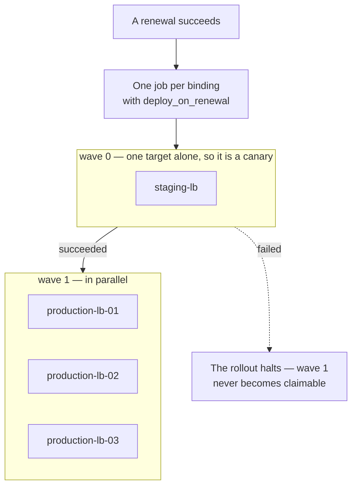

# Deployment

Getting a renewed certificate to the thing that serves it.

This is the point where CertPilot stops observing and starts changing something
that is already carrying traffic, and the whole design is shaped by one
difference:

> Renewal creates new material. **Deployment replaces material that is
> currently in use.**

A renewal that goes wrong leaves a certificate nobody installed — bad, and
fixed by trying again. A deployment that goes wrong replaces a working
certificate on a live listener.

- [Targets and bindings](#targets-and-bindings)
- [The five target types](#the-five-target-types)
- [Deploy on renewal](#deploy-on-renewal)
- [When a rollout halts](#when-a-rollout-halts)
- [Verification](#verification)

---

## Targets and bindings

Two objects, and the split matters.

A **target** is a place: a webhook receiver, a host running the agent, an AWS
account, an F5 appliance. It holds credentials, sealed with the KEK.

A **binding** joins one certificate to one target, with *placement* options —
which ARN, which vault entry, which crypto-store name, which path. One target
can serve many certificates that land in different places on it.

```bash
# a target
curl -X POST localhost:8080/api/v1/deployment-targets -H 'Content-Type: application/json' -d '{
  "name": "edge webhook", "target_type": "webhook",
  "config": {"url": "https://edge.example.com/certpilot", "signing_secret": "..."}}'

# a binding
curl -X POST localhost:8080/api/v1/certificates/$CERT/targets -H 'Content-Type: application/json' -d '{
  "target_id": "<id>", "options": {"path": "/etc/nginx/tls/app.pem"}}'
```

Validation happens at **binding** time, not deploy time, and it is the most
valuable check in the package. Every cloud deployer here has the same failure
available as one omitted field: install successfully, under an identity nothing
is pointing at, and let the thing in front of your users expire on schedule
while a console shows a fresh green certificate. Caught at binding, that is a
400 somebody reads. Caught at deploy time it is a success.

### Which targets get the private key

`deploys_private_key` is a plain column on the target, set at creation from the
deployer's own declaration.

It is stored rather than derived because "which places does this organisation
ship private keys to" has to be answerable **without the KEK**. Deriving it
from a sealed blob would make the answer available only to something that can
decrypt every deployment credential in the system.

---

## The five target types

| Type | Installs by | Needs the key |
|:---|:---|:---|
| `webhook` | Signed HTTP POST to a receiver you write | Optional |
| `agent` | A host running the agent, writing files and reloading | No — the host already has it |
| `aws_acm` | ACM `ImportCertificate` against an existing ARN | Yes |
| `azure_key_vault` | Key Vault certificate import, new version of a name | Yes |
| `f5` | iControl REST: upload, install key, install certificate | Yes |

The schema has allowed `filesystem`, `kubernetes` and `gcp_lb` since migration
001. They are deliberately **not** in this list: accepting a type because a
check constraint tolerates it creates a target that can be configured, bound
and queued, and that fails at the last moment with an error about an unknown
type.

### webhook

```json
{"url": "https://receiver.example.com/hook",
 "signing_secret": "...",
 "headers": {"X-Environment": "production"},
 "include_private_key": false,
 "allow_insecure_http": false}
```

The body is a JSON envelope with the certificate, chain, and metadata. It is
signed with HMAC-SHA256 ([`pkg/webhooksig`](../pkg/webhooksig)) so the receiver
can verify it came from CertPilot rather than from anything that learned the
URL.

`include_private_key` does what it says, and is the reason `deploys_private_key`
exists as a column. `allow_insecure_http` is refused when the key is included.

### agent

Agent targets **appear on their own**. A host running the agent reports where it
installs certificates, and a target named after that host is created. They
cannot be created through the API, and the core-side deployer refuses to deploy
— the work happens on the host, which claims the job over the signed agent API.

See [agent.md](agent.md#installing-where-the-server-reads).

### aws_acm

```json
{"connection_id": "<cloud connection id>"}      // target
{"certificate_arn": "arn:aws:acm:eu-west-1:...:certificate/..."}   // binding
```

Credentials live on a **cloud connection**, not on the target, so one set of
AWS credentials serves many targets. The target's sealed config holds only the
connection reference — decrypt it and you get `{"connection_id":"..."}`.

`certificate_arn` is required at binding. Importing without one creates a *new*
certificate that no load balancer points at, while the old one goes on being
served until it expires. The deployer also refuses a returned ARN that differs
from the one asked for.

SigV4 is signed by hand ([`core/engine/cloudsync/sigv4.go`](../core/engine/cloudsync/sigv4.go)).
There is no AWS SDK anywhere in this project.

### azure_key_vault

```json
{"connection_id": "<cloud connection id>"}     // target
{"certificate_name": "prod-wildcard"}          // binding
```

Imports a new **version** of an existing name. A new name is a certificate
nothing is configured to read.

### f5

```json
{"host": "https://bigip.example.com", "username": "...", "password": "..."}  // target
{"name": "prod-wildcard"}                                                    // binding
```

Login → upload → install key → install certificate, over iControl REST.
`http://` is refused.

`name` must be the crypto-store name the client-SSL profile already references.
**The deployer does not touch the profile** — it replaces what the profile
points at. A new name leaves the virtual server on the previous certificate.

> Key Vault and F5 are written to their published APIs and unit-tested. Neither
> has been run against a real vault or appliance.

---

## Deploy on renewal

A binding created today deploys automatically when its certificate renews.
Bindings that predate the feature do not, until somebody says so — migration
023 set them false deliberately, because switching on automatic writes to live
listeners for an existing estate is not an upgrade, it is a surprise.

It is set on the binding, and defaults to true when omitted — because that is
what a binding means: install this certificate there, including when it
changes. A caller that wants the other behaviour asks for it by name.

```bash
curl -X POST localhost:8080/api/v1/certificates/$CERT/targets \
  -H 'Content-Type: application/json' \
  -d '{"target_id": "<id>", "options": {...}, "deploy_on_renewal": false}'
```

Posting the same certificate and target again updates the existing binding
rather than creating a second one, so this is also how the flag is changed.
There is no separate PATCH route.

The loop, end to end:

```
renewal succeeds
   → enqueue a deployment job per binding with deploy_on_renewal
   → queue claims, deployer installs
   → three minutes later, the verifier opens a connection
   → the fingerprint being served is compared with the one stored
```

The three-minute grace is not zero on purpose: a check that ran the instant a
deployer returned would report the reload it did not wait for.

---

## Rollout order

A target names the wave it goes in, and a wave does not start until every
earlier wave has finished:

```
PUT /api/v1/deployment-targets/:id   {"deploy_order": 1}
```

Lower goes first. Zero is the default and is what every target has unless
somebody says otherwise, which is one wave and exactly the behaviour that
existed before waves did — same-wave targets deploy in parallel.



**A canary is a target on its own in the lowest wave.** One target, exactly one
attempt, and the rest follow only once it has worked. Before waves the queue
paused a rollout after a failure, which is a reaction rather than a plan: every
replica claimed a job before anything had failed, so the first attempt landed on
as many targets at once as there were workers.

The wave is copied onto each job when the rollout is enqueued, not looked up
when it runs. A rollout carries the plan as it stood when it began — otherwise
reordering a target could change a rollout that is halfway through, which is how
production takes a certificate staging never accepted.

Agent-deployed targets are gated the same way. An agent polls for its own work,
and without the same rule a host in wave 2 would install while wave 1 was still
being attempted from the core.

### When an earlier wave fails

Deliberately stricter than the same-wave rule. Within a wave, a target that
gives up stops holding up its peers; across waves it does not, because the whole
point of declaring "staging, then production" is that a certificate staging
would not accept must not reach production.

The way out is the obvious one: **fix the target and deploy again.** The gate
counts only the most recent job for each place, so a staging deployment that now
succeeds releases the waves behind it. It does not count failures from previous
rollouts — an earlier version did, which meant one bad afternoon in staging
blocked production permanently, with no way back because a terminally failed job
cannot be cancelled.

---

## When a rollout halts

If one target fails, **the rest of that certificate's rollout stops.**

```
1 target failed. 2 others are waiting behind it.
```

The reasoning: a certificate that cannot be installed on one member of a pool
is a certificate that probably should not be installed on the rest of it
either. Marching a bad certificate through an estate one node at a time is how
a partial outage becomes a complete one.

The halt is keyed on `last_error` being non-empty rather than on job status,
because a failing job spends part of every retry cycle in `RUNNING` — an
earlier version keyed on status and leaked one deployment per retry cycle.

Fix the failing target and the rollout drains by itself; the queue keeps
retrying, and the moment the failure clears the held-back jobs are claimable.

---

## Verification

Success from a deployer means **bytes were accepted**, not that they are being
served. Those are different claims and the difference is a reload.

```bash
curl -X POST localhost:8080/api/v1/certificates/$ID/verify
```

The verifier opens a TLS connection to the endpoint and compares the
fingerprint. `cert.not_deployed` is raised when a certificate has been renewed
and the old one is still being served.

This is the check that makes the difference between a tool that reports
renewals and a tool that knows whether they worked.
