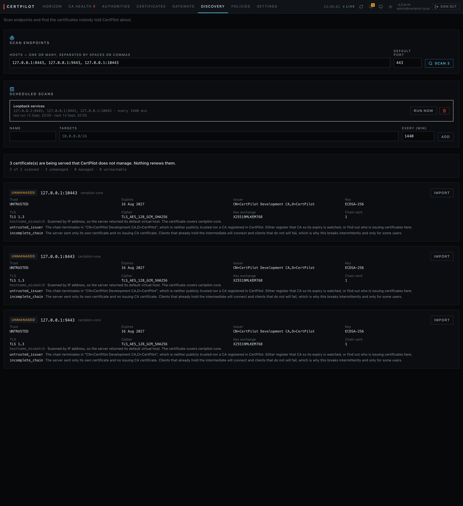

# Discovery

Finding the certificates nobody told you about.

An inventory built only from what CertPilot issued is an inventory of the
problem you have already solved. Three engines look elsewhere:

| | Looks at |
|:---|:---|
| [Network scan](#network-scan) | What is actually being served, by connecting |
| [Certificate Transparency](#certificate-transparency) | What a public CA logged for your domains |
| [Cloud inventory](#cloud-inventory) | What ACM, Key Vault, Google and Kubernetes hold |

Plus a fourth, from the inside: the [agent's file inventory](agent.md#inventory).



*The verdict is the point: "3 certificates are being served that CertPilot does
not manage. Nothing renews them." Each finding says what is wrong in a sentence
— an untrusted issuer, a chain missing its intermediate, a name that does not
match — because "untrusted" alone tells an operator nothing they can act on.*

---

## Network scan

```bash
curl -X POST localhost:8080/api/v1/discovery/scan -H 'Content-Type: application/json' \
  -d '{"targets": ["example.com", "10.0.0.0/24", "internal-api.corp:8443"]}'
```

Targets can be hostnames, IP addresses, CIDR ranges, or any of those with an
explicit port. The scanner opens a TLS connection, completes a handshake, and
records what came back.

The output that justifies having run it is one sentence:

```
6 certificate(s) are being served that CertPilot does not manage. Nothing renews them.
```

A scan of a real estate returns mostly certificates the team issued and already
watches. The rows worth reading are the ones nobody knew about, so **every
result carries a verdict**:

| Verdict | |
|:---|:---|
| `MANAGED` | The fingerprint matches a certificate in the inventory |
| `UNMANAGED` | It does not. Nothing renews this |
| `UNREACHABLE` | No handshake completed |

Matched on **fingerprint**, not hostname. A host serving a certificate for a
name CertPilot manages, from a different certificate, is unmanaged — and that
is exactly the case worth surfacing.

### The second verdict: what the chain terminates in

| Trust | |
|:---|:---|
| `PUBLIC` | Verifies against the host's public root store |
| `INTERNAL` | Verifies against a CA registered in CertPilot — so its own expiry is being watched |
| `SELF_SIGNED` | The leaf signed itself. Common on appliances |
| `UNTRUSTED` | Verifies against nothing known |

`UNTRUSTED` is a finding in its own right: somebody is issuing certificates
from an authority nobody has registered.

### Scheduled scans

```bash
curl -X POST localhost:8080/api/v1/discovery/schedules -H 'Content-Type: application/json' -d '{
  "name": "production edge",
  "targets": ["10.0.0.0/24", "edge.example.com"],
  "interval_minutes": 1440}'
```

The scheduler wakes every minute and runs whatever is due. On an installation
with no schedules that is one indexed query a minute.

Re-scanning the same estate is how `discovery.changed` gets raised — an
endpoint serving a *different* certificate than last time, which is either a
renewal you did not make or a change you did not authorise.

### Importing a result

```bash
curl -X POST localhost:8080/api/v1/discovery/import -H 'Content-Type: application/json' \
  -d '{"result_id": "<id>", "environment": "production", "team": "platform"}'
```

Brings an observed certificate into the inventory so it is tracked and alerted
on.

> **`auto_renew` is forced false on import**, whatever was asked for. Renewal
> needs a private key and a CA account; an observed certificate has neither, and
> a record claiming it will renew itself is the failure mode this whole product
> exists to prevent.

---

## Certificate Transparency

Every publicly trusted certificate is logged. Watching those logs for your own
domains finds certificates issued *for you* that you did not ask for — a
shadow-IT team using their own account, or something worse.

```bash
curl -X POST localhost:8080/api/v1/ct/monitors -H 'Content-Type: application/json' \
  -d '{"domain": "example.com", "include_subdomains": true}'
```

The monitor polls every minute for monitors that are due, matches what it finds
against the inventory by fingerprint, and raises `ct.unmanaged` for anything it
does not recognise.

This only sees **publicly trusted** issuance. A private CA does not log to CT,
which is why the network scan and the agent inventory exist alongside it.

---

## Cloud inventory

Certificates that a cloud provider holds, which CertPilot did not put there.

| Provider | Reads |
|:---|:---|
| `aws_acm` | ACM certificates in a region |
| `azure_key_vault` | Key Vault certificates |
| `gcp` | Google Cloud certificates |
| `kubernetes` | TLS secrets in a cluster |

```bash
curl -X POST localhost:8080/api/v1/cloud/connections -H 'Content-Type: application/json' -d '{
  "name": "production aws", "provider": "aws_acm",
  "config": {"region": "eu-west-1", "access_key_id": "...", "secret_access_key": "..."}}'
```

Credentials are sealed with the KEK, carry `json:"-"` on the model so no handler
can return them by forgetting to strip them, and are shared with the
[ACM and Key Vault deployers](deployment.md) so one set of credentials serves
both inventory and deployment.

### The finding that matters

`cloud.will_not_renew`.

A certificate sitting in ACM or a Key Vault is widely assumed to renew itself.
Often it does not, and the reason varies by provider:

| Provider | Renews itself when | Does not when |
|:---|:---|:---|
| ACM | Issued by ACM and in use by an integrated service | Imported |
| Key Vault | A policy with an `AutoRenew` action exists | Uploaded as a PFX — issuer reads `Unknown` |
| Google | Google-managed | Self-managed upload |
| Kubernetes | Something else is managing the secret | Nothing is |

CertPilot reports which. "This certificate in your load balancer will not renew
and expires in 34 days" is the sentence, and it is one nobody gets from the
provider's own console.

---

## What discovery does not do

**It does not fix anything.** Every engine here produces findings. Acting on
one — importing it, binding it to a target, replacing it — is a deliberate
step somebody takes.

**It does not scan without being asked.** There is no default schedule and no
built-in target list. Scanning address space is something an organisation
authorises.

**Coverage of these tables in the conformance suite is thinner than for
certificates and deployments.** Discovery, CT and cloud-sync tables lean on the
in-memory store for their tests, which is where the next defect of the
store-divergence class will come from. Recorded in [database.md](database.md).
